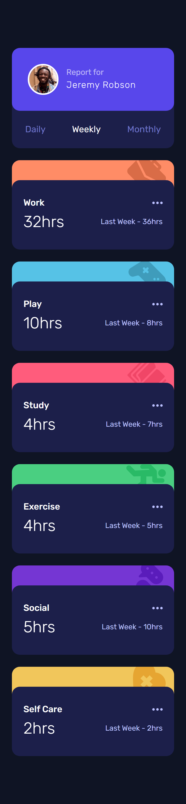

# Frontend Mentor - Time tracking dashboard solution

This is a solution to the [Time tracking dashboard challenge on Frontend Mentor](https://www.frontendmentor.io/challenges/time-tracking-dashboard-UIQ7167Jw). Frontend Mentor challenges help you improve your coding skills by building realistic projects.

## Table of contents

- [Overview](#overview)
  - [The challenge](#the-challenge)
  - [Screenshot](#screenshot)
  - [Links](#links)
- [My process](#my-process)
  - [Built with](#built-with)
  - [What I learned](#what-i-learned)
  - [Continued development](#continued-development)
  - [Useful resources](#useful-resources)
- [Author](#author)

## Overview

This is the second challenge in the **Intro to JavaScript Frameworks Frontend Mentor Roadmap**. It consists of a dashboard showing the time spent on different categories of activities during the current time period and the previous time period.

The time period can be **Daily**, **Weekly** and **Monthly**. The data for the different stats is stored in the local **data.json** file.

### The challenge

Users should be able to:

- View the optimal layout for the site depending on their device's screen size
- See hover states for all interactive elements on the page
- Switch between viewing Daily, Weekly, and Monthly stats

### Screenshot

#### Mobile

##### Mobile Initial View

##### Mobile Active States View

#### Desktop

##### Desktop Initial View

##### Desktop Active States View

### Links

- Solution URL: [Add solution URL here](https://your-solution-url.com)
- Live Site URL: [Add live site URL here](https://your-live-site-url.com)

## My process

### Built with

- Semantic HTML5 markup
- CSS custom properties
- Flexbox
- CSS Grid
- Mobile-first workflow
- [React](https://reactjs.org/) - JS library
- [TypeScript](https://www.typescriptlang.org/) - Type Checking Language Built on top of Javascript.
- [Vite](https://vitejs.dev/) - Bundler and development environment for Frontend.

### What I learned

I used `useState` React hook to keep the state of which time period the user has chosen. the State is typed with the union of string literal types: `"daily" | "weekly" | "monthly"`. to avoid typos.

There are two components created for this project:

- Profile Card
- TimeFrame Card

The Profile Card Component Shows the User Image and Name and allow changing the time period. it takes for it's props the time period and click event handler to set the state to a different period.

The TimeFrame Card Component takes for it's props the activity name, the current/previous time for the activity and the time period selected. it show the different activities cards with their appropriate icons and information.

### Continued development

I had a little of trouble regarding typing. when I made the activities a union of literal string types. because typescript will infer the type of my json data as only string and not `"Work" | "Study" ...`.

therefore I changed the activity prop of the TimeFrame Card component to be a generic string.

I also had the same problem when trying to set the state using the string stored on the buttons data dictionary. typescript infers it to be a string. to solve that I used typescript type predicates. to narrow the type from `string` to `"daily" | "weekly" | "monthly"`.

### Useful resources

- [Vite SVGR Plugin](https://www.npmjs.com/package/vite-plugin-svgr) - This plugin of Vite allow you to import SVGs as React Components. this helped in storing the svgs in an object. So I can render the correct one based on the activity prop passed.

## Author

- Frontend Mentor - [@ilyesab](https://www.frontendmentor.io/profile/ilyesab)
